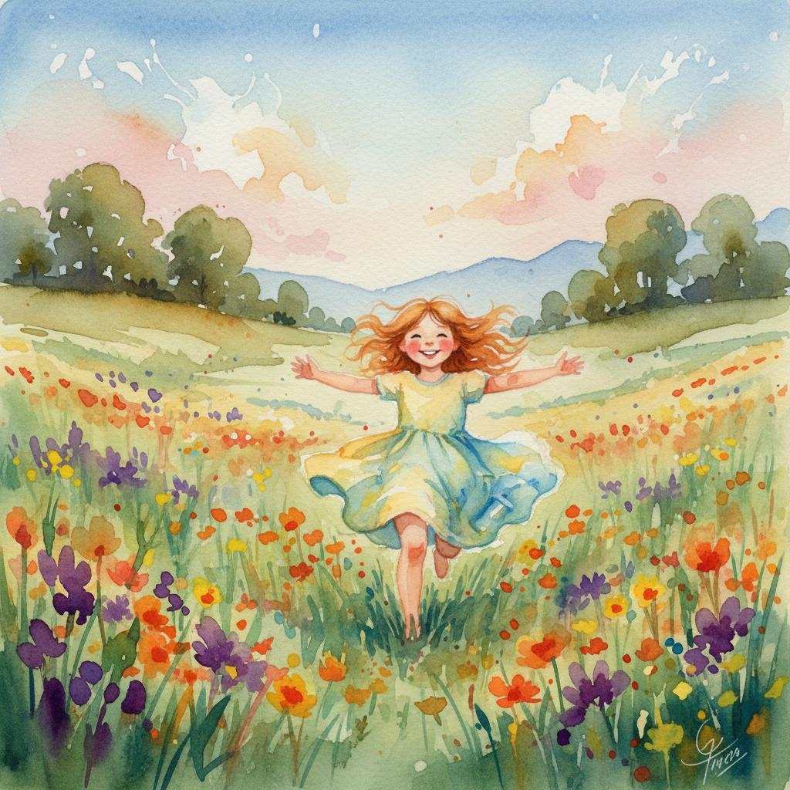

## Animated Image (Gemini → Veo) Skill

Generates a minimalist image with Google's image model, then animates it using the latest video model.

### Demo Outputs

Image:



Video:

- [Watch the demo video on YouTube](https://youtu.be/br81_vMItXs)

Optional thumbnail link:

[](https://youtu.be/br81_vMItXs)

### Quickstart (Personal Skill)

1. Get an API key from [Google AI Studio](https://aistudio.google.com/).
2. Install the skill to your personal Claude skills directory:
   ```bash
   SKILL=animated-image
   mkdir -p ~/.claude/skills
   rsync -a skills/$SKILL ~/.claude/skills/$SKILL
   cd ~/.claude/skills/$SKILL && npm i
   cp -n .env.example .env  # then edit .env and set GOOGLE_API_KEY
   ```
3. Restart Claude Code so it discovers your personal skills.

### Usage

In Claude Code:

- Ask: "Which skills do you have?" and confirm it lists `animated-image`.
- Then: "Use the animated-image skill to create a [your prompt], and animate the most obvious motion."

Outputs are saved to `~/.claude/outputs/` by default (or `OUTPUT_DIR` if set in `.env`).

### Troubleshooting

- If you see a module not found error, run `cd ~/.claude/skills/animated-image && npm i`.
- If the skill doesn’t appear, restart Claude Code.
- Ensure `.env` has `GOOGLE_API_KEY` (or set it in your shell) and try again.


